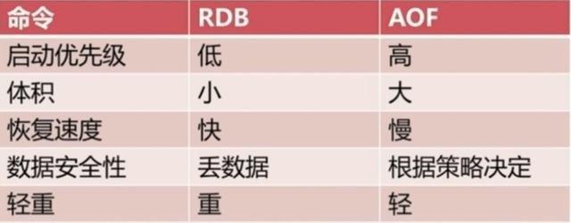

#多线程
##
#reids
reids是内存数据库，它把数据存在内存中，这样在加快读取速度的同时也对数据的安全性产生的新的问题，当redis所在服务器发生宕机的时候redis内存中的所有数据将全部丢失。

为了解决这个问题，redis提供了持久化功能，其实就是把redis数据写入到硬盘中。具体分为RDB和AOP，详情如下：

##RDB
全量写入：RDB
```java
[redis@6381]$ more /usr/local/redis/conf/redis.conf 
save 900 1
save 300 10
save 60 10000
dbfilename "dump.rdb"          #持久化文件名称
dir "/data/dbs/redis/6381"    #持久化数据文件存放的路径
```
上面是redis配置文件里默认的RDB持久化设置，前三行都是对触发RDB的一个条件，例如第一行的意思是每900秒钟里redis数据库有一条数据被修改则触发RDB，依次类推；只要有一条满足就会调用BGSAVE进行RDB持久化。第四行dbfilename指定了把内存里的数据库写入本地文件的名称，该文件是进行压缩后的二进制文件，通过该文件可以把数据库还原到生成该文件时数据库的状态。第五行dir指定了RDB文件存放的目录。

配置文件修改需要重启redis服务，我们还可以在命令行里进行配置，即时生效，服务器重启后需重新配置
```java
[redis@iZ254r8s3m6Z redis]$ bin/redis-cli
127.0.0.1:6379> CONFIG GET save         #查看redis持久化配置
1) "save"
2) "900 1 300 10 60 10000"

127.0.0.1:6379> CONFIG SET save "21600 1000" #修改redis持久化配置
OK
```
RDB持久化分为俩种：SAVE和BGSAVE

SAVE是阻塞式的RDB持久化，当执行这个命令时redis的主进程把内存里的数据库状态写入到RDB文件（即上面的dump.rdb）中，直到该文件创建完毕的这段时间内redis将不能处理任何命令请求。

BGSAVE属于非阻塞式的持久化，它会创建一个子进程专门去把内存中的数据库状态写入RDB文件里，同时主进程还可以处理来自客户端的命令请求。但子进程基本是复制的父进程，这等于两个相同大小的redis进程在系统上运行，会造成内存使用率的大幅增加。



##AOF
增量写入：AOF

与RDB的保存整个redis数据库状态不同，AOF是通过保存对redis服务端的写命令（如set、sadd、rpush）来记录数据库状态的，即保存你对redis数据库的写操作，以下就是AOF文件的内容
```java
[redis@iZ]$ more appendonly.aof
*2
$6
SELECT
$1
0
*3
$3
SET
$47
DEV_USER_LEGAL_F9683BE0E27F1A06C0CB869CEC7E3B22
$11
¬
*3
$3
SET
$47
```
如何配置AOF
```java
[redis@iZ]$ more ~/redis/conf/redis.conf
dir "/data/dbs/redis/6381"           #AOF文件存放目录
appendonly yes                       #开启AOF持久化，默认关闭
appendfilename "appendonly.aof"      #AOF文件名称（默认）
appendfsync no                       #AOF持久化策略
auto-aof-rewrite-percentage 100      #触发AOF文件重写的条件（默认）
auto-aof-rewrite-min-size 64mb       #触发AOF文件重写的条件（默认）
```
要弄明白上面几个配置就得从AOF的实现去理解，AOF的持久化是通过命令追加、文件写入和文件同步三个步骤实现的。

当reids开启AOF后，服务端每执行一次写操作（如set、sadd、rpush）就会把该条命令追加到一个单独的AOF缓冲区的末尾，这就是命令追加；

然后把AOF缓冲区的内容写入AOF文件里。看上去第二步就已经完成AOF持久化了那第三步是干什么的呢？这就需要从系统的文件写入机制说起：一般我们现在所使用的操作系统，为了提高文件的写入效率，都会有一个写入策略，即当你往硬盘写入数据时，操作系统不是实时的将数据写入硬盘，而是先把数据暂时的保存在一个内存缓冲区里，等到这个内存缓冲区的空间被填满或者是超过了设定的时限后才会真正的把缓冲区内的数据写入硬盘中。也就是说当redis进行到第二步文件写入的时候，从用户的角度看是已经把AOF缓冲区里的数据写入到AOF文件了，但对系统而言只不过是把AOF缓冲区的内容放到了另一个内存缓冲区里而已，之后redis还需要进行文件同步把该内存缓冲区里的数据真正写入硬盘上才算是完成了一次持久化。

而何时进行文件同步则是根据配置的appendfsync来进行：

appendfsync有三个选项：always、everysec和no：

1、选择always的时候服务器会在每执行一个事件就把AOF缓冲区的内容强制性的写入硬盘上的AOF文件里，可以看成你每执行一个redis写入命令就往AOF文件里记录这条命令，这保证了数据持久化的完整性，但效率是最慢的，却也是最安全的；

2、配置成everysec的话服务端每执行一次写操作（如set、sadd、rpush）也会把该条命令追加到一个单独的AOF缓冲区的末尾，并将AOF缓冲区写入AOF文件，然后每隔一秒才会进行一次文件同步把内存缓冲区里的AOF缓存数据真正写入AOF文件里，这个模式兼顾了效率的同时也保证了数据的完整性，即使在服务器宕机也只会丢失一秒内对redis数据库做的修改；

3、将appendfsync配置成no则意味redis数据库里的数据就算丢失你也可以接受，它也会把每条写命令追加到AOF缓冲区的末尾，然后写入文件，但什么时候进行文件同步真正把数据写入AOF文件里则由系统自身决定，即当内存缓冲区的空间被填满或者是超过了设定的时限后系统自动同步。这种模式下效率是最快的，但对数据来说也是最不安全的，如果redis里的数据都是从后台数据库如mysql中取出来的，属于随时可以找回或者不重要的数据，那么可以考虑设置成这种模式。


https://baijiahao.baidu.com/s?id=1654694618189745916&wfr=spider&for=pc


##RDB优势
（1）RDB文件紧凑，全量备份，非常适合用于进行备份和灾难恢复。

（2）生成RDB文件的时候，redis主进程会fork()一个子进程来处理所有保存工作，主进程不需要进行任何磁盘IO操作。

（3）RDB 在恢复大数据集时的速度比 AOF 的恢复速度要快。
###RDB劣势
RDB快照是一次全量备份，存储的是内存数据的二进制序列化形式，存储上非常紧凑。当进行快照持久化时，会开启一个子进程专门负责快照持久化，子进程会拥有父进程的内存数据，父进程修改内存子进程不会反应出来，所以在快照持久化期间修改的数据不会被保存，可能丢失数据。
###AOF优势
（1）AOF可以更好的保护数据不丢失，一般AOF会每隔1秒，通过一个后台线程执行一次fsync操作，最多丢失1秒钟的数据。

（2）AOF日志文件没有任何磁盘寻址的开销，写入性能非常高，文件不容易破损。

（3）AOF日志文件即使过大的时候，出现后台重写操作，也不会影响客户端的读写。

（4）AOF日志文件的命令通过非常可读的方式进行记录，这个特性非常适合做灾难性的误删除的紧急恢复。比如某人不小心用flushall命令清空了所有数据，只要这个时候后台rewrite还没有发生，那么就可以立即拷贝AOF文件，将最后一条flushall命令给删了，然后再将该AOF文件放回去，就可以通过恢复机制，自动恢复所有数据

###AOF劣势
（1）对于同一份数据来说，AOF日志文件通常比RDB数据快照文件更大

（2）AOF开启后，支持的写QPS会比RDB支持的写QPS低，因为AOF一般会配置成每秒fsync一次日志文件，当然，每秒一次fsync，性能也还是很高的

（3）以前AOF发生过bug，就是通过AOF记录的日志，进行数据恢复的时候，没有恢复一模一样的数据出来。
