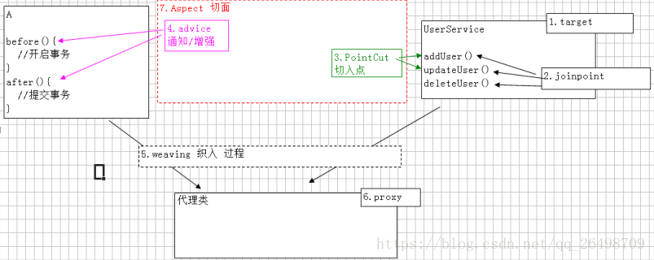

# 一些面试题

## 项目相关

1. 介绍一下你简历上写的项目？自己主要做了什么？（*简历上虽然写了，但是面试官还是问了*）
2. 你觉得项目里给你最大的挑战是什么？遇到了什么问题？如何解决的？从中学到了什么？
3. 项目的架构图能画一下不？（*一个很 low 的后台网站*）
4. 觉得项目有哪些地方可以改进完善？（*我说可以加一个 redis 缓存把热点数据缓存起来*）
5. 为什么要用 Nginx?有啥用？优缺点？
6. 有没有遇到过内存泄漏的场景?

## java基础

###1. StringBuilder 和 StringBuffer
1. StringBuilder执行速度要比StringBuffer快
2. StringBuilder是线程非安全的，StringBuffer是线程安全的
3. 使用场景：
    - 操作少量的字符串使用String
    - 在单线程情况下，字符串缓冲区使用StringBuilder
    - 多线程情况下，字符串缓冲区使用StringBuffer

---
###2. 如何实现静态代理？有啥缺陷？

---
如何实现静态代理：创建代理类实现目标类接口，并引入接口

缺陷：静态代理不够灵活，必须为每个对象创建一个实现了相同接口的代理对象，并且代理对象中的方法也要和原对象一致，因此任何目标对象的变动，代理对象都要变。
  所有代码都写死了，不够灵活，不能在运行时改变。
###3. 动态代理的作用？在哪些地方用到了？（*AOP、RPC 框架中都有用到*）

---
####mybatis中的应用：
我们在使用mybatis的时候，只写了接口，却可以使用，原因就是mybaits通过jdk动态代理的方式帮我们生成了接口的实现，在源码中，MapperProxy类实现了InvocationHandler，在MapperProxyFactory中有如下代码：
```java>
protected T newInstance(MapperProxy<T> mapperProxy) {
    return (T) Proxy.newProxyInstance(mapperInterface.getClassLoader(), new Class[] { mapperInterface }, mapperProxy);
  }

  public T newInstance(SqlSession sqlSession) {
    final MapperProxy<T> mapperProxy = new MapperProxy<>(sqlSession, mapperInterface, methodCache);
    return newInstance(mapperProxy);
  }
```
mybatis会帮我们将接口和它生成的代理类放入MapperRegistry类中来使用。

####AOP中的应用

以com.study.useaop.csdncase包中示例来说
1. target 目标类，需要被代理的类 如UserService
2. joinpoint 连接点，所谓连接点就是那些可能被拦截到的方法 例如：所有方法
3. pointCut 切入点 已经被增强的连接点 例如：addUser()
4. advice 通知/增强 增强代码，如 MyAspect中的 before(),after()
5. weaving 织入 把增强advice应用到目标对象target来创建新的代理对象Proxy的过程
6. proxy 代理类
7. aspect 切面 切入点和通知advice的结合

###4. JDK 的动态代理和 CGLIB 有什么区别？

---
JDK动态代理只能对实现了接口的类生成代理，而不能针对类
CGLIB动态代理针对类的实现产生代理，是生成目标类的一个子类，并覆盖其方法。

###5. 谈谈对 Java 注解的理解，解决了什么问题？
####理解
我觉得注解像一个标签，可以给类，方法，字段等进行标注，注解的写法有一些约束，通过元注解来体现。

比如@Targer定义了使用的地方@Retention注解可以保留的时机@Documented可以将注解中的元素加载到javadoc文档中去。

我们在自定义了一个注解的同时，还需要自己定义一个注解处理器，明确这个注解是做什么用的，定义他的规则。
####作用
其实他是可以提供信息给编译器，编译器的处理，运行时的处理。结合我们自定义的注解处理器来工作。
###6. Java 反射？反射有什么缺点？你是怎么理解反射的（为什么框架需要反射）

## 集合框架

HashMap 的底层实现、JDK 1.8 的时候为啥将链表转换成红黑树？、HashMap 的负载因子、HashMap 和 Hashtable 的区别？

有哪些集合是线程不安全的？怎么解决呢？

什么是快速失败(fail-fast)、能举个例子吗？、什么是安全失败(fail-safe)呢？

## 多线程

在多线程情况下如何保证线程安全

synchronized 作用，底层实现

ReetrantLock 和 synchronized 的区别

AQS

线程池作用？Java 线程池有哪些参数？阻塞队列有几种？拒绝策略有几种？

线程死锁

ThreadLocal 是什么，应用场景是什么，原理是怎样的

介绍一下 Java 有哪些锁(synchronized、juc 提供的锁如 ReentrantLock、CountDownLatch、CyclicBarrier、Semaphore 等)

## JVM

讲一下 JVM 的内存结构（还问了每个区域的调优配置参数，我蒙了)

Minor gc 和 Full gc 的区别，详细介绍

方法区和永久代的关系？

JDK 1.8 HotSpot 的永久代为啥被彻底移除？有哪些常用参数？

主要进行 gc 的区域。永久代会发生 gc 吗？元空间呢？

各种垃圾回收算法和回收器，说出自己的理解

zgc ？zgc vs g1？（我懵逼了~我只是听过有这个东西，完全没有去了解过）

## 数据库

讲一下乐观锁和悲观锁;

说一下 MVCC

说一聚簇索引和非聚簇索引的有什么不同

关于索引的各种轰炸**(索引相关的知识太重要了！！！**

## 网络

为什么网络要分层？

TCP/IP 4 层模型了解么？

http 是哪一层的协议？

http 和 https 什么区别

http2.0（*不知道*）

tcp 三次握手过程、滑动窗口是干什么的？

Mac 地址和 ip 地址的区别？既然有了 Mac 地址，为什么还要 ip 地址呢？

当你打开一个电商网站，都需要经历哪些过程？

电子邮件的发送过程?

## Spring

1. Spring AOP 和 IOC 的底层实现
2. Spring Boot 了解不？和 Spring 啥区别？
3. Spring Boot 的启动类源码有了解过吗

## 其他

1. 工作想 base 在哪里？为什么？
2. 平时有什么兴趣爱好？
3. 自己未来有什么规划？
4. 平时是如何学习新技术的？（*官网/书籍/博客/视频*）
5. 一般遇到问题如何解决？（*Google 和 Stackoverflow，虽然我平时很少用 Stackoverflow，但是还是和面试官说我经常用，**哈哈哈！*）
6. 介不介意加班？（*求生欲让我回答不介意*）
7. 你有什么问题想问我？（*我问了工作强度、项目上女生多不多*）

## 总结

1. 一定要准备好自我介绍。自我介绍尽量和简历上写的更加丰富一点，突出自己的能力。
2. 一面主要问的是项目，所以，在面试之前一定要对项目很熟悉！项目的优化点、技术栈、架构图等等都要搞清楚。
3. 阿里面试总体感觉比较重视基础，所以 Java 那些基本功一定要扎实。然后，网络部分也要格外重视。
4. 阿里面试官对于一些问题问的很深入，我没有准备太好，结果导致 2 面就翻车了。






